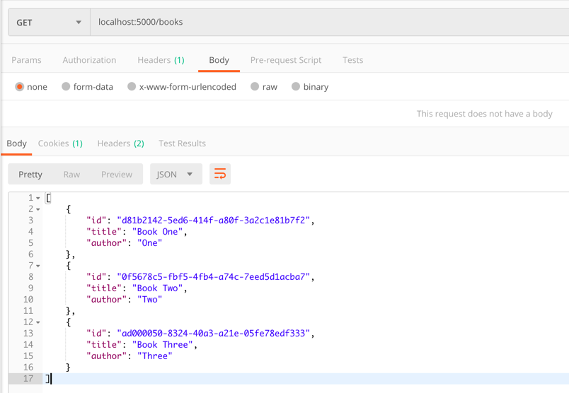
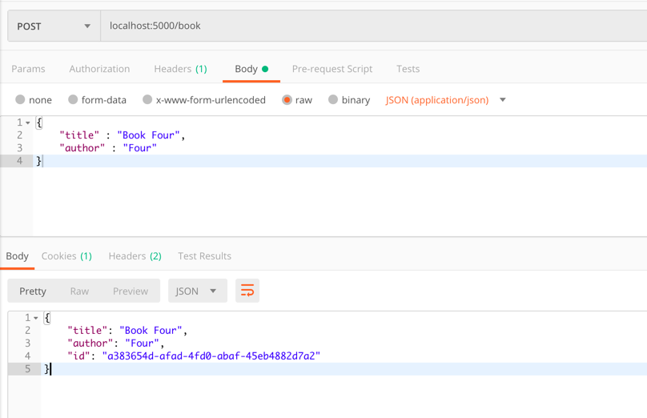

# Deno Test Demo

Deno 1.0.0이 출시되어 만들어보는 데모 앱
Deno에 대한 설명은 

## 실행 방법 및 구조 설명
``` bash
deno run --allow-net server.ts
```
- `routers.ts` : path, methos별 요청에 대한 분기. controller 역할을 수행
- `server.ts` : server application을 구성한다.
- `types.ts` : typescript 타입을 명시

## API

### Get: All Books


### Get: get Book by UUID



### Post: Book

